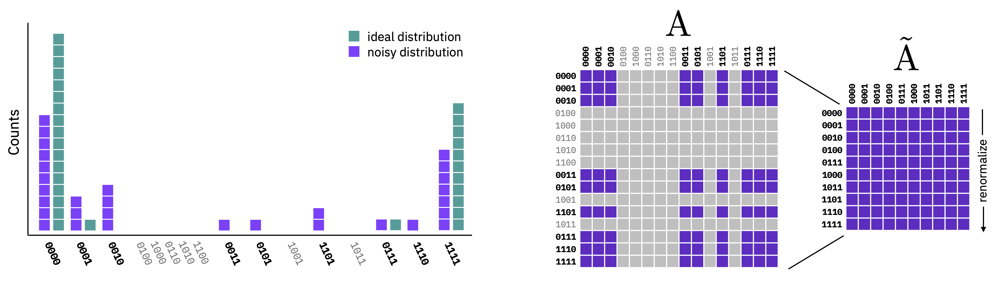

##################
mthree (|version|)
##################

mthree is a package for scalable quantum measurement error mitigation that need not
explicitly form the assignment matrix, or its inverse, as is thus a **m**\atrix-free
**m**\easurement **m**\itigation (M3) routine.

M3 works in a reduced subspace defined by the noisy input bitstrings that are to be
corrected.  Because the number of unique bitstrings can be much smaller than the
dimensionality of the full multi-qubit Hilbert space, the resulting linear system
of equations is nominally much easier to solve.

It is often the case that this linear equation is trivial to solve using LU decomposition,
using only modest computing resources.  However, if the number of unique bistrings is large,
and / or one has very tight memory constraints, then the problem can be solved in a matrix-free
manner using a preconditioned interative linear solution method, e.g. the Generalized minimal
residual (GMRES) or biconjugate gradient stabilized (BiCGSTAB) methods.

.. toctree::
    :maxdepth: 1
    :hidden:

    self
    Installation <installation>
    Citing <citing>

.. toctree::
    :maxdepth: 1
    :caption: User guide
    :hidden:
 
    Basic usage <basic>
    Transpiled circuits <transpiled>
    Error analysis <error>
    Obtaining probabilities <probs>
    Using Collections <collections>
    Saving and loading calibrations <cal_io>
    Advanced usage <advanced>

.. toctree::
    :maxdepth: 2
    :caption: Tutorials
    :hidden:
    :glob:

    tutorials/*

.. toctree::
    :maxdepth: 1
    :caption: API Documentation
    :hidden:
 
    Mitigation class <apidocs/main>
    Distributions <apidocs/classes>
    Utility functions <apidocs/utils>